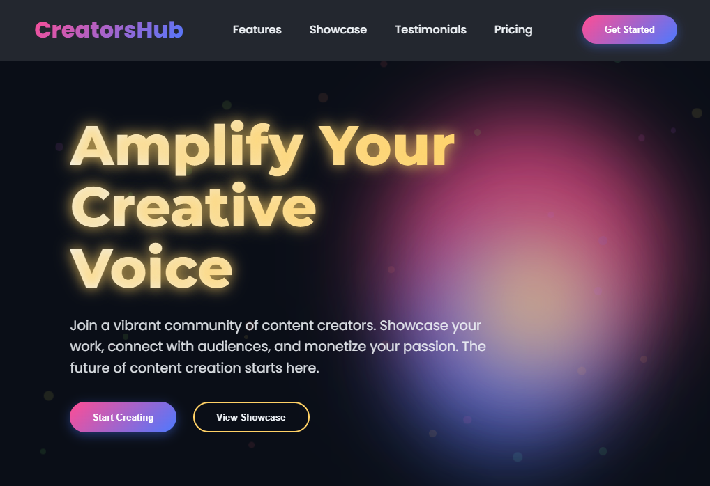

# CreatorsHub - Modern Content Creator Portfolio Template



CreatorsHub is a cutting-edge portfolio template designed specifically for content creators looking to showcase their work in a visually stunning and professional manner. This template combines modern design aesthetics with powerful functionality to help creators stand out in the digital landscape.

## Live Demo & Repository
🌐 **Live Demo:** [https://worldsocoled.github.io/CreatorsHubTemplate/](https://worldsocoled.github.io/CreatorsHubTemplate/)  
💻 **GitHub Repository:** [https://github.com/worldsocoled/CreatorsHubTemplate](https://github.com/worldsocoled/CreatorsHubTemplate)

## Key Features

### 🌟 Modern Aesthetic
- Dark theme with vibrant gradient accents
- Glassmorphism design elements
- Dynamic particle background system
- Floating animated shapes with smooth transitions
- Responsive design for all devices

### 🚀 Interactive Elements
- Animated Header: Changes on scroll with blur effect
- Fade-in Animations: Elements appear as users scroll
- Hover Effects: Interactive cards with elevation and glow
- Gradient Text: Dynamic text effects with CSS gradients
- Floating Particles: Background particle system for visual interest

### 📱 Content Sections
- **Hero Section**
  - Animated glowing headline
  - Floating gradient shapes
  - Particle background system
  - Dual CTA buttons with hover effects
- **Features Section**
  - Six feature cards with icons
  - Hover animations and elevation effects
  - Gradient icon styling
- **Showcase Gallery**
  - Asymmetrical grid layout
  - Hover overlays with project details
  - Image zoom effect on hover
  - Responsive grid system
- **Testimonials**
  - Quote-styled testimonials
  - Author avatars with gradient backgrounds
  - Card hover animations
- **Call-to-Action**
  - Full-width gradient section
  - Prominent CTA button
- **Footer**
  - Multi-column layout
  - Social media icons with hover effects
  - Comprehensive link organization

## ⚙️ Technical Highlights
- Pure CSS implementation (no external frameworks)
- CSS Variables for easy theming
- CSS Grid and Flexbox for advanced layouts
- Intersection Observer API for scroll animations
- Dynamic particle generation with JavaScript
- Responsive design with mobile-first approach

## Customization Options
Easily customize the template by modifying the CSS variables at the top of the file:

```css
:root {
    --primary: #FF4D94;
    --secondary: #4D79FF;
    --accent: #FFD166;
    --dark: #0A0E17;
    --light: #F0F4F8;
    --gradient-1: linear-gradient(135deg, var(--primary), var(--secondary));
    --gradient-2: linear-gradient(135deg, var(--accent), var(--primary));
    --glass-bg: rgba(255, 255, 255, 0.1);
    --glass-border: rgba(255, 255, 255, 0.2);
    --shadow: 0 8px 32px rgba(0, 0, 0, 0.2);
    --header-height: 90px;
}
```

## How to Use:

1. **Clone the Repository**:

```bash
git clone https://github.com/worldsocoled/CreatorsHubTemplate.git
```
2. **Customize Content**:

- Update text content in index.html

- Replace placeholder images with your own work

- Modify the color scheme in the :root variables

- Update social media links in the footer

- Deploy to GitHub Pages

3. **Create a new GitHub repository**

- your customized files to the repository

- Go to Settings > Pages

- Select your branch (typically main or gh-pages) and deploy

## Browser Support
**CreatorsHub is compatible with all modern browsers including**:

- Chrome (latest)

- Firefox (latest)

- Safari (latest)

- Edge (latest)

## Credits

- Font Awesome for icons

- Google Fonts for typography (Poppins and Montserrat)

- Unsplash for placeholder images

- WorldSoColed Web Artistry for design and development

## License

This template is open-source and available under the MIT License. Feel free to use it for personal and commercial projects.

Showcase your creative work in style with CreatorsHub - The ultimate portfolio template for modern content creators looking to make an impact!

